

# PA4 Submission: TaskFlow Pipeline

## Student Information

| Field | Value |
|---|---|
| Name | Usman Khalid |
| Roll Number | 27100001 |
| GitHub Repository URL | https://github.com/UsmanKhalid-20/CS487-PA4 |
| Resource Group | `rg-sp26-27100001` |
| Assigned Region | `ukwest` |

---

## Task 1: App Service Web App (15 points)

### Evidence 1.1: Forked Repository
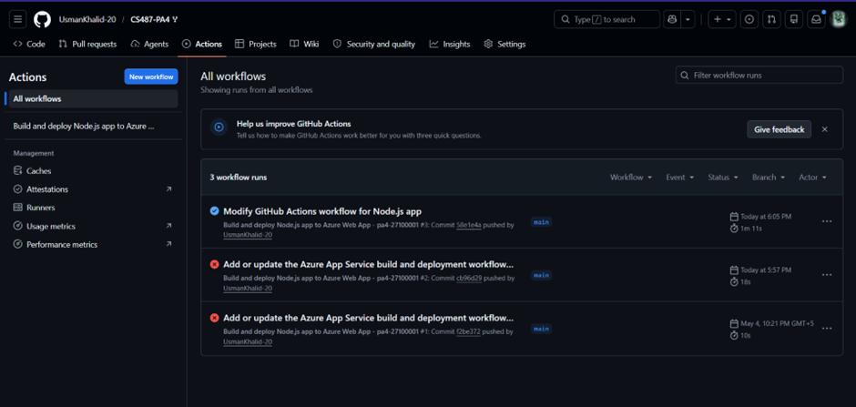
Forked from KarmaMS/CS487-PA4 into my own GitHub account.

### Evidence 1.2: App Service Overview
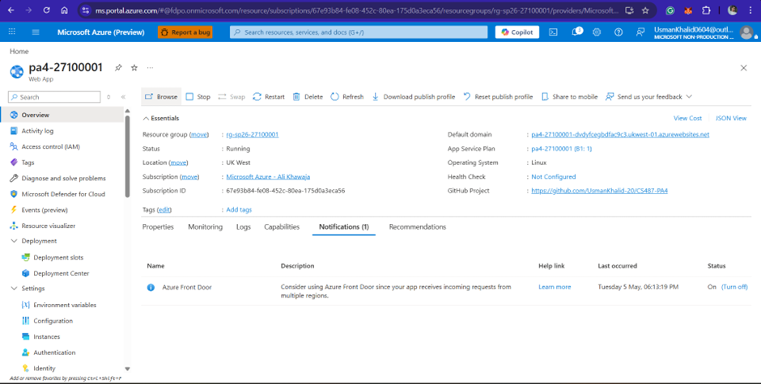
Web App `pa4-27100001` running in `rg-sp26-27100001`, UK West, on B1 Linux plan.

### Evidence 1.3: Deployment Center / GitHub Actions
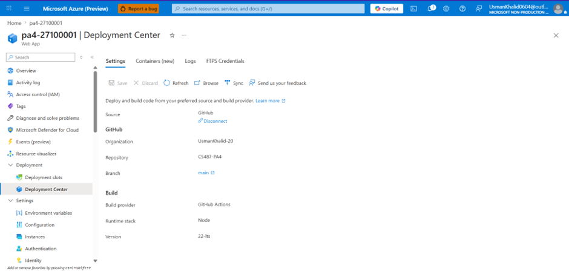
Web App is connected to the main branch of my GitHub fork via GitHub Actions CI/CD.

### Evidence 1.4: Live Web UI
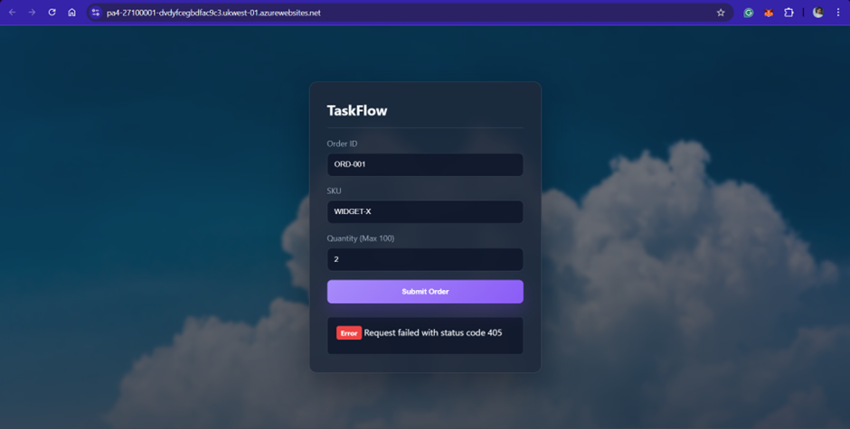
TaskFlow order form is loading successfully over HTTPS from App Service.

---

## Task 2: Azure Container Registry (15 points)

### Evidence 2.1: ACR Overview
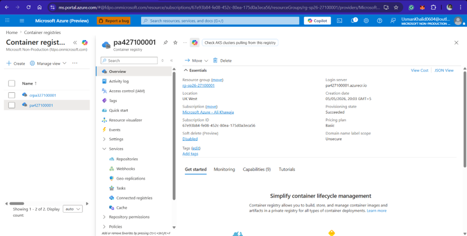
Registry `pa427100001` created in `rg-sp26-27100001`, UK West, Basic SKU.

### Evidence 2.2: Docker Builds
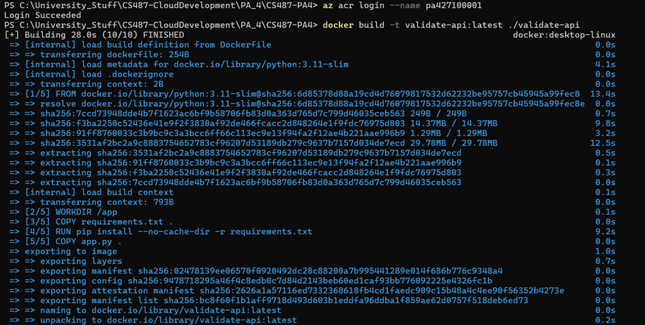
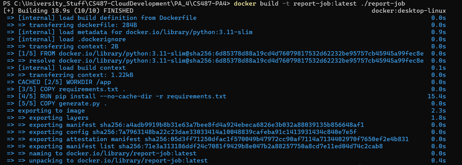
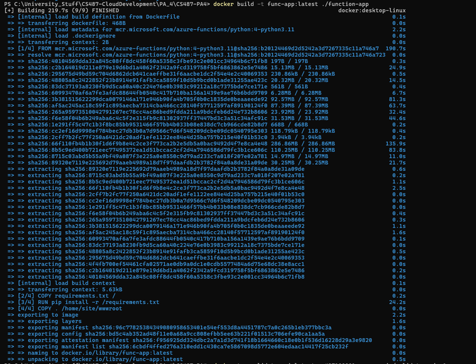
All three images built locally: `validate-api` from `validate-api/`, `report-job` from `report-job/`, `func-app` from `function-app/`.

### Evidence 2.3: ACR Repositories
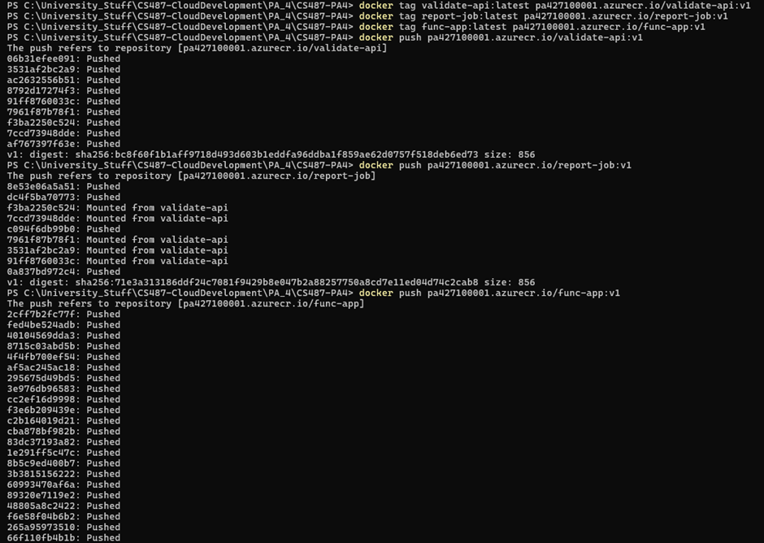
All three images pushed: `validate-api:v1`, `report-job:v1`, `func-app:v1` visible in ACR.

---

## Task 3: Durable Function Implementation (12 points)

### Evidence 3.1: Completed Function Code
[function_app.py](function-app/function_app.py)
Orchestrator calls `validate_activity` first; if valid, calls `report_activity` to spawn an ACI and return the PDF URL.

### Evidence 3.2: Local Function Handler Listing
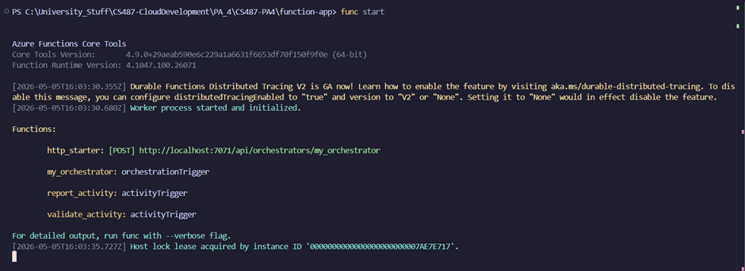
All four handlers registered: `http_starter`, `my_orchestrator`, `validate_activity`, `report_activity`.

---

## Task 4: Function App Container Deployment (8 points)

### Evidence 4.1: Function App Container Configuration

Function App `pa4-27100001-func` deployed using image `pa427100001.azurecr.io/func-app:v1`.

### Evidence 4.2: Orchestration Smoke Test
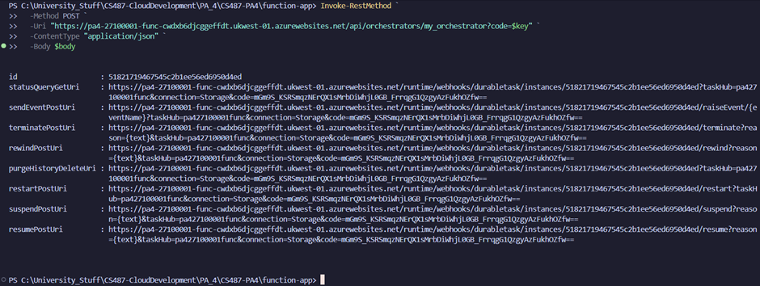
The curl response contains an `id` and `statusQueryGetUri`, proving the orchestration started successfully.

### Evidence 4.3: Expected Failed Status
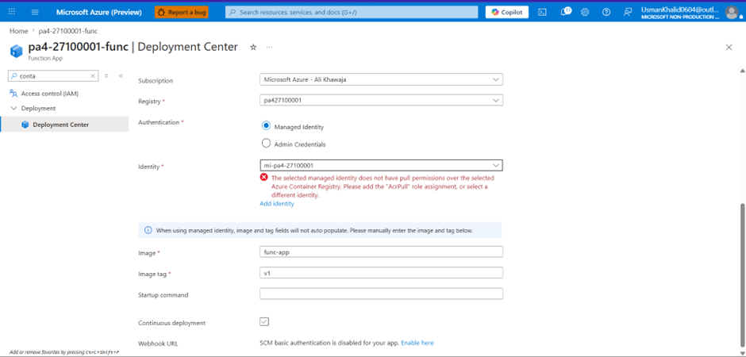
Orchestration fails at `validate_activity` because `VALIDATE_URL` is not yet set — this is expected at this stage.

---

## Task 5: AKS Validator (15 points)

### Evidence 5.1: AKS Cluster
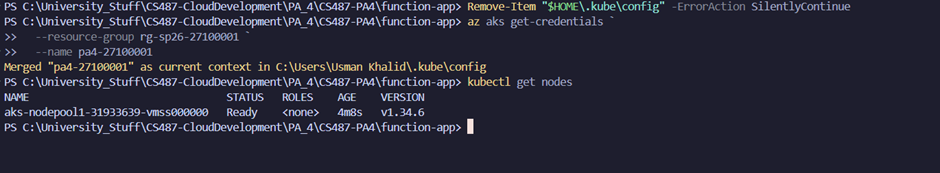
Cluster `pa4-27100001` in `rg-sp26-27100001`, UK West, 1 node, `Standard_B2s`.

### Evidence 5.2: Kubernetes Nodes and Pods
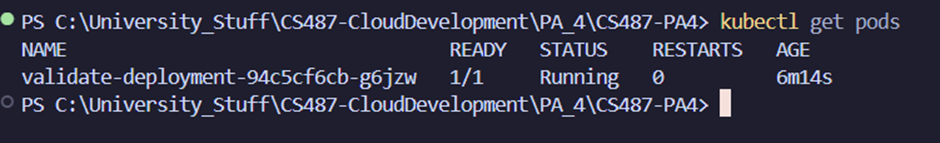
One node in `Ready` state, validator pod running with status `1/1 Running`.

### Evidence 5.3: Kubernetes Service
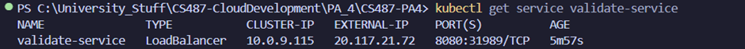
`validate-service` of type LoadBalancer with external IP `20.117.21.72` on port `8080`.

### Evidence 5.4: Validator API Tests
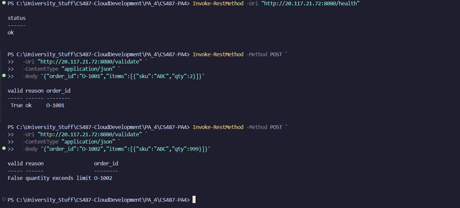
`/health` returns ok. Valid order (`qty=2`) returns `valid: true`. Invalid order (`qty=999`) returns `valid: false, reason: quantity exceeds limit`.

### Evidence 5.5: Function App VALIDATE_URL
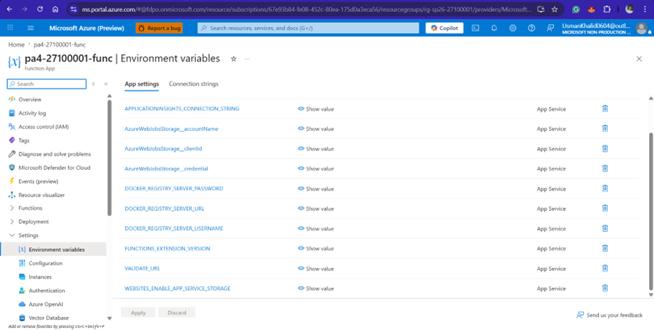
`VALIDATE_URL` set to `http://20.117.21.72:8080/validate` in Function App environment variables.

### Evidence 5.6: AKS Idle Behavior

AKS node stays running and billing even when no orders are being processed — it never scales to zero.

---

## Task 6: ACI Report Job (15 points)

### Evidence 6.1: Blob Container
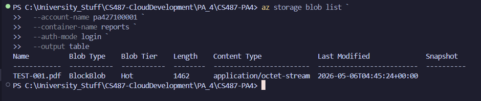
`reports` container created in storage account `pa427100001` to store generated PDFs.

### Evidence 6.2: Manual ACI Run
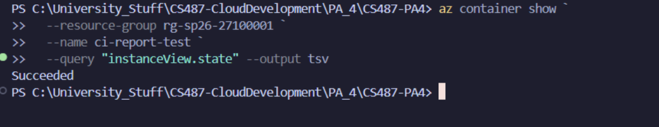
`ci-report-test` container reached `Succeeded` state after running the report job and exiting.

### Evidence 6.3: ACI Logs
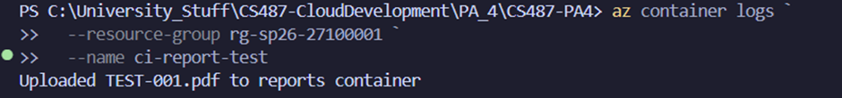
Logs show `Uploaded TEST-001.pdf to reports container`, confirming successful PDF generation and upload.

### Evidence 6.4: Generated PDF
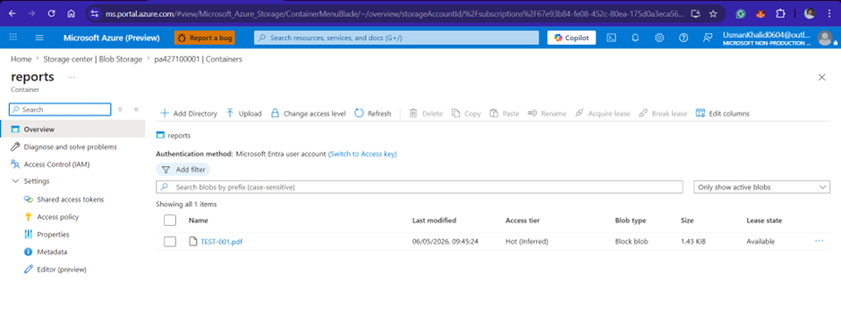
`TEST-001.pdf` visible in the `reports` blob container, proving the ACI wrote to storage successfully.

### Evidence 6.5: Function App Managed Identity
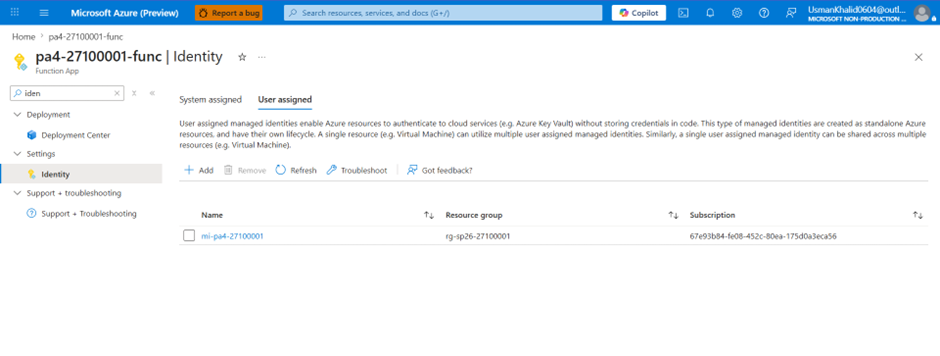
`mi-pa4-27100001` user-assigned identity attached to the Function App, allowing it to create ACIs without storing credentials.

### Evidence 6.6: Report App Settings
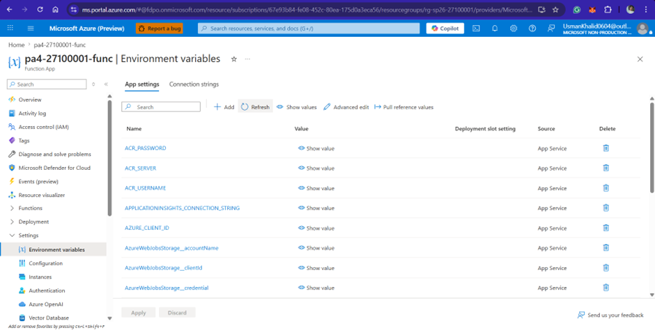
`REPORT_IMAGE`, `ACR_SERVER`, `ACR_USERNAME`, `STORAGE_ACCOUNT_URL`, `SUBSCRIPTION_ID`, and `AZURE_CLIENT_ID` all configured. Passwords masked.

---

## Task 7: End-to-End Pipeline (15 points)

### Evidence 7.1: Web App Wiring
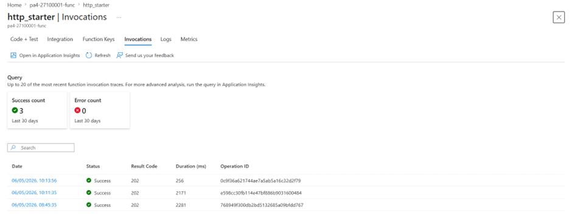
`FUNCTION_START_URL` and `FUNCTION_STATUS_URL` set on Web App `pa4-27100001`, pointing to the Function App.

### Evidence 7.2: Happy Path UI
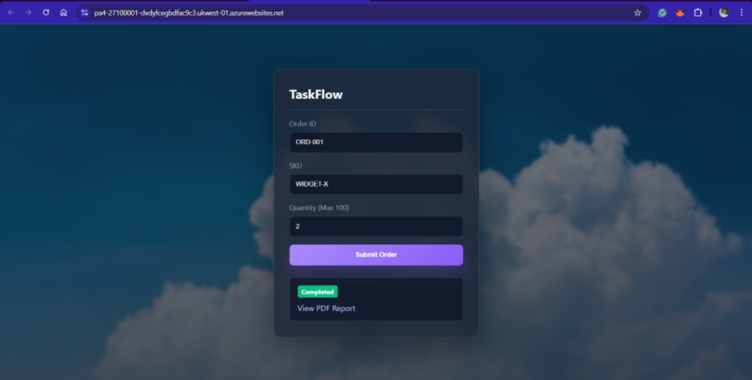
Order `ORD-001` with `qty=2` submitted, status moved from `Running` to `Completed` with a report URL returned.

### Evidence 7.3: Backend Participation
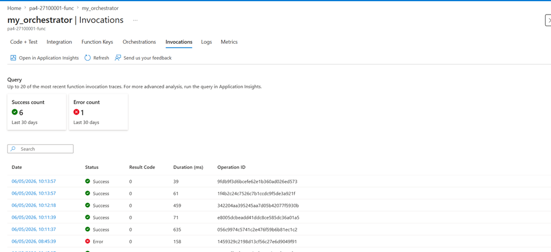
Function App invocation logs show orchestrator, validate_activity, and report_activity all executed for `ORD-001`. PDF visible in blob storage.

### Evidence 7.4: Reject Path UI
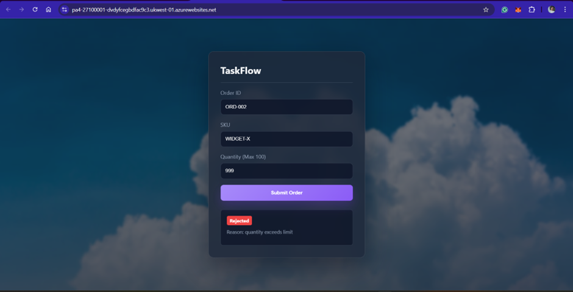
Order `ORD-002` with `qty=999` rejected by the validator. No ACI was created, orchestrator returned `status: rejected`.

---

## Task 8: Write-up and Architecture Diagram (5 points)

### Evidence 8.1: Architecture Diagram
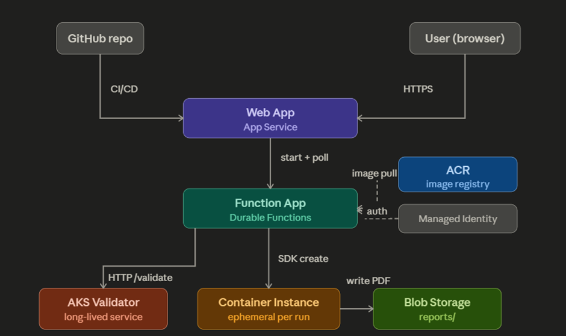
Diagram shows GitHub → App Service, App Service → Function App, Function App → AKS validator, Function App → ACI report job, ACI → Blob Storage, ACR providing images to all services, and managed identity relationship.

### Question 8.2: Service Selection
- **App Service**: Hosts the web frontend with GitHub CI/CD. Stays running persistently to serve user requests.
- **Durable Functions**: Manages the multi-step order pipeline with state checkpointing between steps, so failures don't restart the whole flow.
- **AKS**: Runs the validator as a long-lived HTTP service that's always ready to handle requests for every order.
- **Container Instances**: Runs the report job as a one-shot task that exits when done — no idle cost.

### Question 8.3: ACI vs AKS
- AKS node keeps running and billing even when idle; the validator pod is always alive waiting for requests.
- ACI has no idle state — the container only exists while the report job runs, then it's deleted.
- If 1000 orders were spammed, ACI would cost the most since a new billable container is created per order.

### Question 8.4: Durable Functions vs Plain HTTP
- Plain HTTP functions have a ~10 minute timeout, so the report step would get cut off mid-execution.
- Without Durable Functions there's no state persistence — if `report_activity` fails, the whole order has to restart from validation.

### Question 8.5: Cost Review
The AKS node (`Standard_B2s`) was the most expensive resource as it ran continuously throughout the assignment.

### Question 8.6: Challenges Faced
- **Storage DNS error**: Function App couldn't connect to blob storage because the storage account didn't exist yet. Fixed by creating `pa427100001` manually via CLI.
- **PowerShell JSON quoting**: `ORDER_JSON` had its quotes stripped when passed to `az container create`. Fixed by using a YAML config file instead.